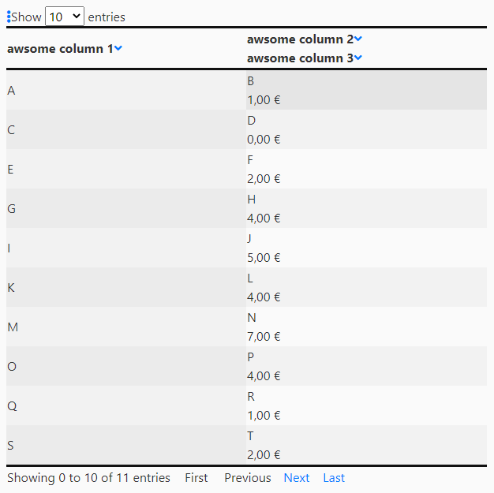

# boss-table
powerful javascript table with the following features:
* Pagination
* asc/desc natural sort (correct sort for strings, numbers and dates)
* display multiple data columns in single table column
* Hide/Show selected table columns
* for every data point a display/render value or html element can be assigned
* all format options of javascript toLocaleString supported



# Provided examples
* [basic example](simple_example.html)
* [example for displaying two data columns in one table column with line break](display_column_example.html)
* [example for providing different display values for data points](complex_data_example.html)
* [example for format options](format_options_example.html)
* [example for custom option and sorting icons/elements](display_column_example.html)

# Getting started
you need to import the js-script and css-stylesheet in your html header
```html
<link rel="stylesheet" type="text/css" href="boss_table.css">
<script type="text/javascript" src="boss_table.js"></script>
```
Define a placeholding table and (optional) a div for the pagination navigation in your html body
```html
<table id="example" class="boss-table"></table>
<div id="example_pagination" class="boss-table pagination"></div>
```
You can choose the id of the table, as you like. But you need to name the div for pagination alike with the postfix "_pagination".
Create a script-tag in your body or header, defining the table data, table description and call the function "CreateBossTable" to create the table.
```html
<script type="text/javascript">
dataSet = [
    {col1: "A", col2: "B", col3: 1},
    {col1: "C", col2: "D", col3: 0},
    {col1: "E", col2: "F", col3: 2},
    {col1: "G", col2: "H", col3: 4},
    {col1: "I", col2: "J", col3: 5},
    {col1: "K", col2: "L", col3: 4},
    {col1: "M", col2: "N", col3: 7},
    {col1: "O", col2: "P", col3: 4},
    {col1: "Q", col2: "R", col3: 1},
    {col1: "S", col2: "T", col3: 2},
    {col1: "U", col2: "B", col3: 3},
]

tableDescr = {
 data: dataSet,
 name: "example",
 pagination: 1,
 columns: [
            { title: "awsome column 1", data: "col1"},
            { title: "awsome column 2", data: "col2"},
            { title: "awsome column 3", data: "col3"}
          ],

   page_length: 10,
}
  
CreateBossTable(tableDescr);
</script>
```
The array *dataSet* holds every row of the table as dictionary/object. The values of the key-value-pairs may have the following types: float/integer/Date/string. For more complex types, like DOM-Elements, please check the [complex data example](complex_data_example.html).
The *tableDescr* dictionary describes the table format. The key *data* has to hold the *dataSet* array. The key *name* must hold the same name as value, like the placeholder table.
The value for *pagination* can be 1 (on) or 0 (off). If *pagination* is off, you can ignore *page_length*. Otherwise *page_length* is the number of rows per page.
The *columns* key holds an array with one dictionary element per data column. With the key *title*, you set the title of the column defined with the key *data*. The value of the *data* key must be one valid key in the *dataSet* array.

Pass the dictionary *tableDescr* to the function *CreateBossTable*. This function will create a table at the placeholder position. If you call *CreateBossTable* like shown above, the *<script>* must be called after the *<table.../>* placeholder. 
In the examples a different way with the usage of *jquery* is shown. In that case you need to include *jquery* in your html header. You should also include
```html
<script src="https://kit.fontawesome.com/2f6feeec4b.js" crossorigin="anonymous"></script>
```
to have the sort and options icons correctly shown. If you want to use different icons pls look into the [example for custom option and sorting icons/elements](display_column_example.html). You can specify custom DOM-Elements for these three icons. The DOM-Elements need to accept the *.setAttribute("id","..."))* command. Thus you cannot use a simple *TextNode*, but you have to wrap a *div* or *span* Node around it. Any *class* or *id* setting for the outer element will be overwritten. You can either use an inner *div*/*span* element with your own class or stick the given class for styling.

